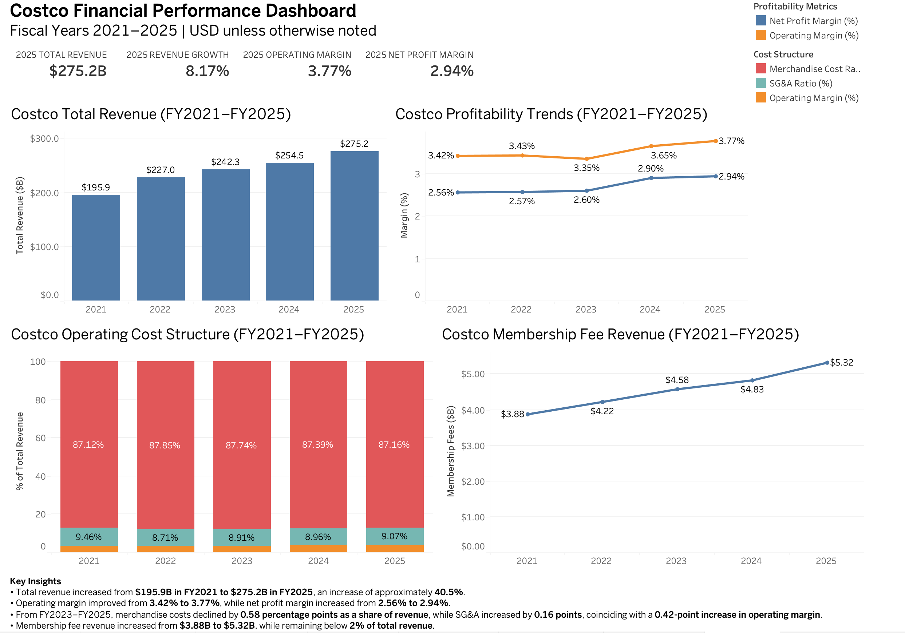

# Costco Financial Operations & Performance Analysis

## Dashboard



## Project Overview

This project analyzes Costco's financial and operating performance from fiscal year 2021 through fiscal year 2025. The analysis focuses on revenue growth, profitability, operating cost structure, membership fee revenue, liquidity, and long-term debt.

The project uses an end-to-end data analysis workflow involving Excel, Python, SQL, and Tableau to transform reported financial data into financial metrics, analytical queries, and an interactive dashboard.

## Business Questions

This project explores the following questions:

- How has Costco's revenue changed from FY2021 to FY2025?
- How have operating and net profit margins changed?
- What changes in Costco's operating cost structure accompanied changes in profitability?
- How has membership fee revenue changed?
- How have Costco's liquidity and long-term debt position changed?

## Tools Used

- **Excel** — Financial statement data collection and organization
- **Python (Pandas)** — Data cleaning, transformation, KPI calculations, and CSV export
- **SQL (SQLite)** — Financial analysis, comparisons, aggregation, and validation
- **Tableau** — Data visualization and financial performance dashboard
- **VS Code** — Project development and file management

## Data

Financial data was collected from Costco's annual reports for fiscal years 2021–2025.

The dataset includes information from the income statement and balance sheet, including:

- Net Sales
- Membership Fees
- Total Revenue
- Merchandise Costs
- SG&A
- Operating Income
- Net Income
- Current Assets and Liabilities
- Long-Term Debt
- Stockholders' Equity

Financial statement amounts are reported in USD millions unless otherwise specified.

## Data Analysis Workflow

### 1. Excel

Collected and organized five years of reported financial statement data into separate Income Statement and Balance Sheet worksheets.

### 2. Python

Used Pandas to:

- Import Excel financial statement data
- Merge income statement and balance sheet data by fiscal year
- Validate data types and missing values
- Calculate financial KPIs
- Export a cleaned analytical dataset

Calculated metrics included:

- Revenue Growth
- Operating Margin
- Net Profit Margin
- Current Ratio
- Long-Term Debt-to-Equity Ratio
- Membership Fee Growth
- Membership Fee Revenue Share
- Merchandise Cost Ratio
- SG&A Ratio

### 3. SQL

Loaded the cleaned dataset into a SQLite database and used SQL to analyze:

- Revenue and profitability trends
- Operating cost structure
- Membership fee growth and revenue contribution
- Liquidity and long-term debt trends
- Overall financial performance

SQL queries were also used to validate calculations produced in Python.

### 4. Tableau

Created an interactive financial performance dashboard containing:

- Revenue Trend
- Profitability Trends
- Operating Cost Structure
- Membership Fee Revenue Growth
- 2025 KPI summary cards

## Key Findings

- Total revenue increased from **$195.9 billion in FY2021 to $275.2 billion in FY2025**, representing approximately **40.5% cumulative growth**.
- Operating margin increased from **3.42% to 3.77%**, while net profit margin increased from **2.56% to 2.94%**.
- Between FY2023 and FY2025, merchandise costs declined by **0.58 percentage points as a share of revenue**, while SG&A increased by **0.16 percentage points** and operating margin increased by **0.42 percentage points**.
- Membership fee revenue increased from approximately **$3.88 billion to $5.32 billion** between FY2021 and FY2025.
- Long-term debt-to-equity declined from **0.37 in FY2021 to 0.20 in FY2025**.

## Project Structure

```text
Costco-Financial-Analysis/
├── data/
│   ├── raw/
│   │   └── costco_financials.xlsx
│   └── cleaned/
│       └── costco_financials_cleaned.csv
├── python/
│   └── financial_analysis.py
├── sql/
│   ├── costco_financials.db
│   └── analysis_queries.sql
├── dashboard/
│   └── costco_financial_dashboard.png
└── README.md
```